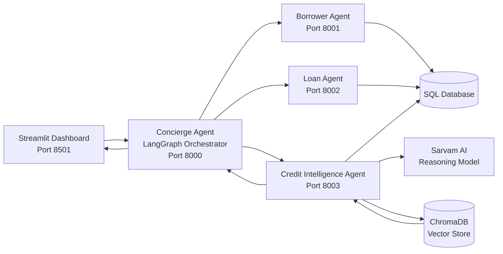

# CredAI — Federated Multi-Agent Private Credit System

[](https://www.python.org/)
[](https://fastapi.tiangolo.com/)
[](https://streamlit.io/)
[](https://github.com/astral-sh/ruff)

An AI-powered private credit platform where specialized agents collaborate to onboard borrowers, structure loans, analyze credit risk, and generate explainable credit insights.

## What is CredAI?

CredAI is a **federated multi-agent AI system for private credit workflows**.

Instead of using a single AI model to handle the entire process, CredAI separates the workflow into specialized agents for:

* Borrower onboarding
* Loan structuring
* Credit intelligence
* Workflow orchestration

A central **LangGraph-based orchestration layer** coordinates these agents through independent **FastAPI services**.

The system combines **deterministic financial validation**, **LLM-powered reasoning**, and **RAG-based retrieval** to produce structured and plain-English credit assessments.

## The Problem

Private credit evaluation involves multiple connected steps — collecting borrower information, validating financial constraints, structuring loan terms, assessing risk, and reviewing relevant information.

Building this as one large AI workflow can make the system harder to maintain, validate, and extend.

CredAI explores a different approach: **breaking the workflow into specialized agents while keeping critical financial rules deterministic and auditable.**

## What the System Does

* 👤 Onboards and validates borrower information
* 💰 Structures loan terms and calculates DSR/LTV
* 🧠 Performs AI-assisted credit and sector analysis
* 🔎 Retrieves relevant information using RAG
* 🤝 Coordinates specialized agents through LangGraph
* 📄 Generates plain-English credit committee reports
* 📊 Provides an interactive Streamlit dashboard
* 🔐 Uses internal API authentication between services
* 📝 Maintains audit events for credit intelligence workflows

## 📸 Dashboard Preview

*CredAI Streamlit dashboard for borrower onboarding, loan structuring, credit analysis, and RAG-based querying.*


## 🏗️ Architecture

CredAI follows a **federated multi-agent architecture** where each agent is independently exposed as a FastAPI service.



### Core Components

#### 1. Streamlit Dashboard — Port 8501

The frontend provides:

* Borrower onboarding
* Loan application and structuring
* Credit report visualization
* Financial ratio displays
* RAG query interface
* Database-backed borrower quick loading

#### 2. Concierge Agent — Port 8000

The orchestration layer coordinates the complete workflow using **LangGraph**.

Responsibilities include:

* Gathering workflow inputs
* Calling the appropriate peer agents
* Managing the multi-step workflow
* Collecting agent responses
* Generating the final credit committee report

#### 3. Borrower Agent — Port 8001

Responsible for borrower profile management.

Key responsibilities:

* Borrower onboarding
* Profile persistence
* Income validation
* Duplicate-safe/idempotent onboarding
* Borrower retrieval

#### 4. Loan Agent — Port 8002

Responsible for loan structuring and financial validation.

It calculates:

* Debt-Service Ratio (DSR)
* Loan-to-Value (LTV)
* Loan repayment metrics

It also enforces configured financial safety limits before the application proceeds.

#### 5. Credit Intelligence Agent — Port 8003

Responsible for credit intelligence and AI-assisted analysis.

It:

* Computes risk scores and default probabilities
* Generates sector-level insights using Sarvam AI
* Stores audit events
* Creates searchable credit summaries
* Indexes information in ChromaDB
* Supports semantic RAG queries

## ✨ Key Features

### 1. Multi-Agent Workflow Orchestration

CredAI separates responsibilities across specialized agents instead of placing the entire workflow inside one AI component.

```text
User
  ↓
Streamlit Dashboard
  ↓
Concierge Agent
  ↓
┌──────────────┬──────────────┬─────────────────────┐
│              │              │                     │
▼              ▼              ▼                     │
Borrower      Loan      Credit Intelligence         │
Agent         Agent           Agent                 │
│              │              │                     │
└──────────────┴──────────────┴─────────────────────┘
                       ↓
              Credit Committee Report
```

This makes individual services easier to develop, test, and extend independently.

### 2. Deterministic Financial Validation

Critical financial constraints are handled through explicit business rules rather than relying on the LLM.

Current validation rules include:

| Rule                  |    Limit |
| --------------------- | -------: |
| Minimum annual income |  $50,000 |
| Minimum loan amount   | $100,000 |
| Maximum DSR           |      45% |
| Maximum LTV           |      75% |

DSR:

```text
DSR = (Monthly Payment × 12) / Annual Income
```

LTV:

```text
LTV = Loan Amount / Collateral Value
```

### 3. AI-Assisted Credit Intelligence

The Credit Intelligence Agent combines:

* Structured financial information
* Rule-based validation
* Sarvam AI reasoning
* Sector analysis
* Retrieval-augmented generation

The goal is to use the LLM for **reasoning and explanation**, while keeping important financial constraints deterministic.

### 4. RAG-Based Credit Search

Credit summaries are indexed into **ChromaDB** and can be queried semantically.

This allows users to ask natural-language questions such as:

```text
Manufacturing sector risk profiles with good collateral
```

The system retrieves relevant indexed information rather than relying only on the LLM's internal knowledge.

### 5. Plain-English Credit Reports

CredAI generates credit committee reports designed to explain financial metrics in understandable language.

The report can explain:

* Loan terms
* DSR
* LTV
* Risk factors
* Sector insights
* Retrieved market information

### 6. Database Quick-Load

Previously onboarded borrowers can be loaded from the database after a browser refresh or session reset.

This avoids forcing users to repeat the onboarding process during development and testing.

### 7. Audit Logging

The Credit Intelligence Agent maintains SQL-based audit events for important processing steps, providing additional traceability around the credit intelligence workflow.


## 🛠️ Tech Stack

| Layer               | Technologies                   |
| ------------------- | ------------------------------ |
| Language            | Python                         |
| Backend             | FastAPI, Uvicorn               |
| Agent Orchestration | LangGraph                      |
| LLM                 | Sarvam AI                      |
| RAG                 | ChromaDB, embeddings           |
| Frontend            | Streamlit                      |
| Database            | SQLite / SQL-based persistence |
| API Communication   | REST                           |
| Validation          | Python business rules          |
| Testing             | Pytest                         |
| Code Quality        | Ruff                           |
| Configuration       | Environment variables          |

## 📁 Project Structure

```text
CredAI/
│
├── src/
│   ├── agents/
│   │   ├── concierge_agent/
│   │   ├── borrower_agent/
│   │   ├── loan_agent/
│   │   └── credit_intelligence_agent/
│   │
│   └── frontend/
│       └── app.py
│
├── tests/
├── docs/
│   └── assets/
│       └── dashboard_home.png
│
├── requirements.txt
├── pyproject.toml
├── docker-compose.yml
├── LICENSE
└── README.md
```

---

# 🚀 Getting Started

## Prerequisites

Make sure you have:

* Python 3.11 or 3.12
* Git
* An active internet connection
* A Sarvam AI API key

## 1. Clone the Repository

```bash
git clone https://github.com/Soujuhegde/CredAI---Private-Credit-Platform-.git
cd CredAI---Private-Credit-Platform-
```

## 2. Create a Virtual Environment

### Windows PowerShell

```powershell
python -m venv .venv
.venv\Scripts\Activate.ps1
```

If PowerShell blocks script execution:

```powershell
Set-ExecutionPolicy -ExecutionPolicy RemoteSigned -Scope Process
```

Then activate the environment again.

### Windows Command Prompt

```cmd
python -m venv .venv
.venv\Scripts\activate.bat
```

### macOS / Linux

```bash
python -m venv .venv
source .venv/bin/activate
```

## 3. Install Dependencies

```bash
pip install -r requirements.txt
```

# 🔑 Environment Configuration

Create a `.env` file in the project root.

```env
# Sarvam AI
SARVAM_API_KEY=your-sarvam-api-key
LLM_MODEL=sarvam-m
LLM_BASE_URL=https://api.sarvam.ai/v1

# Internal service authentication
INTERNAL_API_KEY=your-internal-api-key

# Agent service URLs
BORROWER_AGENT_URL=http://localhost:8001
LOAN_AGENT_URL=http://localhost:8002
CREDIT_AGENT_URL=http://localhost:8003

# Embeddings / Vector Store
EMBED_MODEL=text-embedding-3-small
CHROMA_PATH=./chroma_db

# Logging
LOG_LEVEL=INFO
```

# 🏃 Running the Application

CredAI currently runs as four backend services plus the Streamlit frontend.

Open **five terminal windows** and activate the virtual environment in each.

## 1. Start the Concierge Agent

```bash
uvicorn src.agents.concierge_agent.main:app --port 8000 --reload
```

## 2. Start the Borrower Agent

```bash
uvicorn src.agents.borrower_agent.main:app --port 8001 --reload
```

## 3. Start the Loan Agent

```bash
uvicorn src.agents.loan_agent.main:app --port 8002 --reload
```

## 4. Start the Credit Intelligence Agent

```bash
uvicorn src.agents.credit_intelligence_agent.main:app --port 8003 --reload
```

## 5. Start the Streamlit Dashboard

```bash
streamlit run src/frontend/app.py
```

Open:

```text
http://localhost:8501
```

---

# ⚡ API Reference

## Concierge Agent — Port 8000

| Method | Endpoint           | Purpose                        |
| ------ | ------------------ | ------------------------------ |
| `POST` | `/process`         | Orchestrates the full workflow |
| `GET`  | `/agents`          | Discovers active peer agents   |
| `GET`  | `/query?q=<query>` | Proxies semantic RAG queries   |

## Borrower Agent — Port 8001

| Method | Endpoint          | Purpose                   |
| ------ | ----------------- | ------------------------- |
| `POST` | `/borrowers`      | Create a borrower profile |
| `GET`  | `/borrowers/{id}` | Retrieve a borrower       |

## Loan Agent — Port 8002

| Method | Endpoint      | Purpose                          |
| ------ | ------------- | -------------------------------- |
| `POST` | `/loans`      | Validate and structure a loan    |
| `GET`  | `/loans/{id}` | Retrieve structured loan metrics |

## Credit Intelligence Agent — Port 8003

| Method | Endpoint                        | Purpose                         |
| ------ | ------------------------------- | ------------------------------- |
| `POST` | `/intelligence`                 | Generate credit intelligence    |
| `GET`  | `/intelligence/query?q=<query>` | Query the ChromaDB vector store |


# 🤝 Contributing

Contributions are welcome.

1. Fork the repository.
2. Create a feature branch:

```bash
git checkout -b feature/AmazingFeature
```

3. Make your changes.
4. Run the test suite:

```bash
pytest
```

5. Run Ruff:

```bash
ruff check src/
```

6. Commit your changes:

```bash
git commit -m "Add some AmazingFeature"
```

7. Push the branch:

```bash
git push origin feature/AmazingFeature
```

8. Open a Pull Request.

# 👤 Author

**Soujanya S P**

AI Engineer | Generative AI | Agentic AI

* GitHub: [@Soujuhegde](https://github.com/Soujuhegde)
* LinkedIn: [Soujanya S P](https://www.linkedin.com/in/soujanyasp02)
* Project: [CredAI — Private Credit Platform](https://github.com/Soujuhegde/CredAI---Private-Credit-Platform-)


The project focuses not only on generating AI responses, but on engineering the workflow around them — **specialized agents, service boundaries, validation, retrieval, orchestration, persistence, and explainable outputs.**
